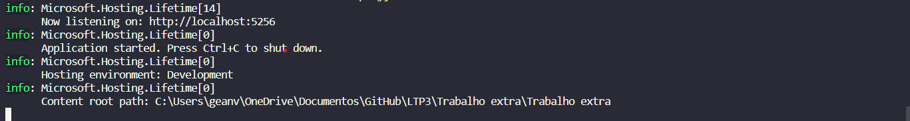
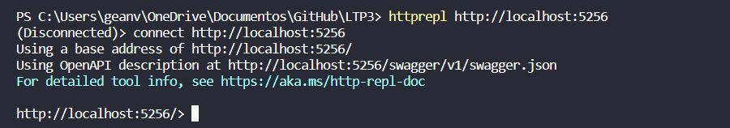
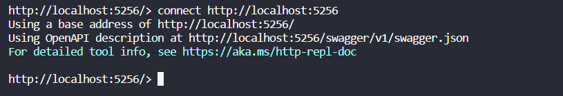
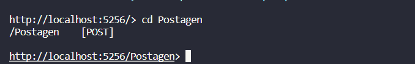
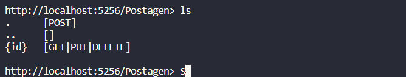
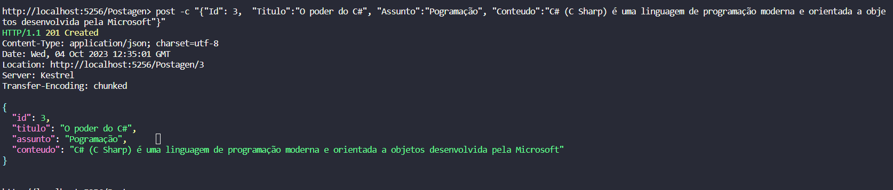
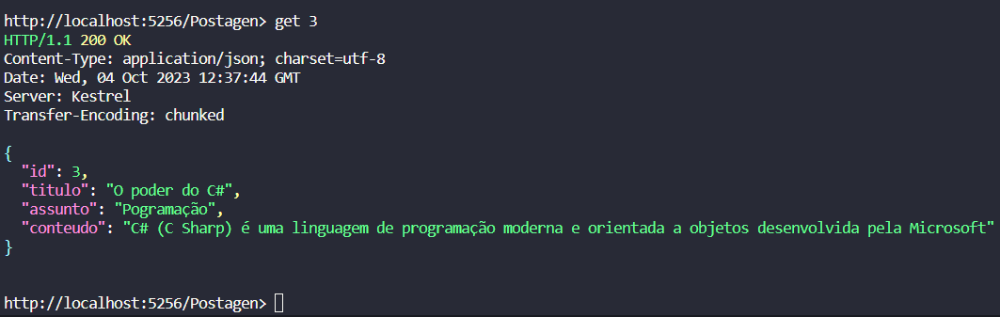

1-Para rodar o projeto insira no terminal o comando #dotnet run e a seguinte mensagen ira aparecer:

2-em sequida abra outro terminal para usarmos o REPL do Asp.Net e rode o comando #httprepl http://localhost:{PORT} e você vera no console:

3-em sequida rode o comando # connect https://localhost:{PORT} e a sequinte mensagen aparecera:

4-Após Vá até o ponto de extremidade Postagen executando o seguinte comando cd Postagen:

5-Execute o seguinte comando para ver as novas ações na API de Postagen:

6-Faça uma solicitação POST para adicionar uma nova Postagen a HttpRepl usando o seguinte comando , 
post -c "{"Id": 3,  "Titulo":"O poder do C#", "Assunto":"Pogramação", "Conteudo":"C# (C Sharp) é uma linguagem de programação moderna e orientada a objetos desenvolvida pela Microsoft"}" 
E você recebera a seguinte mensagen:

7- Podemos ver todas as Postagen usando o comando get:

